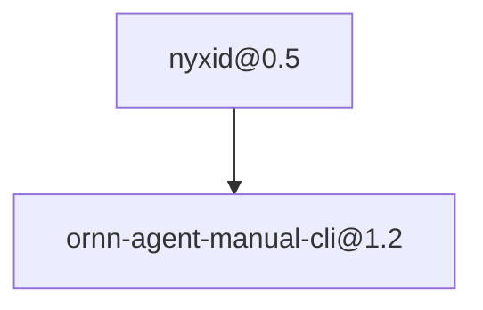

# chronoai-service-manual-bundle

> The official skillset consisting of core agent manuals to operate ChronoAI official services.

---

**Mirrored from [Ornn](https://ornn.chrono-ai.fun/skillsets/chronoai-service-manual-bundle) — read-only.**

A curated multi-skill Claude Code plugin. Edits here are NOT propagated
back; manage this skillset on Ornn.

- Latest version: `1.2`
- Skills bundled: 12

## Master prompt

How an agent should orchestrate the members of this set:

The official skillset consisting of core agent manuals to operate ChronoAI official services.

<!-- ornn:deps:start -->

<!-- ornn:deps:end -->

## Skills in this plugin

- `aevatar-feasibility-advisor@1.0` — Decide — honestly — whether a thing the user wants to build on Aevatar is possible, what its prerequisites are, or why it cannot be done, BEFORE anyone starts building. Use this first whenever a user describes a goal rather than a concrete artifact — "can aevatar do X", "I want a bot that…", "build me something that posts to Twitter / reads my GitHub / replies on Telegram", "is it possible to…", "automate … every day". It teaches the one hard premise (every third-party capability is brokered by NyxID), the two distinct surfaces (outbound connector vs inbound channel), how to check what is actually connectable, the prerequisite for each capability class, what is host-gated (and so not self-serve), and what is genuinely impossible without new NyxID/Aevatar platform work — so you can negotiate scope and give the user a straight answer plus next steps instead of over-promising. It scopes; it does not build (hand off to workflow-authoring / team-builder / service-publisher / scheduler).
- `aevatar-platform-map@1.6` — Entry point, panorama, and router for the entire Aevatar skill family — load this FIRST whenever someone wants to build, run, publish, schedule, or operate anything on Aevatar ("create an agent team", "make a workflow / member", "publish or bind a service", "register it with NyxID", "set up a recurring / cron run", "invoke my service"), wants to know whether something is even possible ("can Aevatar do X?", "能不能用 aevatar 实现"), or just wants to know what Aevatar can do. It teaches the object model (scope → team → member[workflow|script|gagent] → service → schedule), how to authenticate as a NyxID-bearer REST client, how to resolve your scope, and the two caller modes (client REST vs in-session server-side tools). It does not do the work itself — it routes you to the right companion skill (feasibility-advisor, workflow-authoring, team-builder, service-publisher, scheduler, plus diagnostics probes and the safety-net fallback), held together by the shared `aevatar` tag.
- `aevatar-scheduler@1.4` — Create and manage cron schedules that fire an Aevatar service on a recurring basis, authenticated as the scope owner via NyxID — over the REST API. Use when a user wants to "schedule", "run on a cron", "set up a recurring run", "run every day/hour/Monday", "automate this service on a timer", "preview a cron", "pause/resume/disable a schedule", or "run it now". It builds the schedule against a published service (identity + endpoint + payload + serving revision), uses scope-owner NyxID auth (which requires the owner's NyxID broker binding), and covers preview, enable/disable, run-now, update, and delete. Publish the service first with the service-publisher skill.
- `aevatar-service-publisher@1.3` — Publish an Aevatar member, team, or workflow as an invocable service and (host permitting) register it with NyxID, then verify and invoke it — all over the REST API. Use when a user wants to "publish/bind a service", "expose my workflow/team as a service", "register it with NyxID", "make it callable", "get the service slug/URL", "invoke my service", or "version/deploy/roll out a service". It covers the simple scope binding, reading back a member's published service, the full account-level service lifecycle (revision → publish → deploy → rollout), how to confirm the NyxID registration (slug + status), and how to invoke an endpoint. Build the team/member first with the team-builder skill.
- `aevatar-team-builder@1.3` — Build an Aevatar agent team and its members over the REST API. Use when a user wants to "create a team", "add a member", "make a workflow member / script member / gagent member", "set the team's entry point", or "assemble agents into a team". It creates the team, creates members whose implementation is a workflow (most common), a script, or a hosted gagent, binds each member's concrete implementation (the workflow YAML is attached here), waits for the async binding to succeed, and sets the team entry member. Author the workflow YAML first with the workflow-authoring skill; publish the result as a service with the service-publisher skill.
- `aevatar-triage@1.2` — Use AFTER something goes wrong while using Aevatar — a user hits an error, failure, or confusing behavior and you must find whether it lives in Aevatar, NyxID, or Ornn, then act. Triggers - "aevatar is erroring", "why did my workflow fail", "my scheduled run did not fire", "my bot does not reply", "connector 401/403", "skill won't pull/upload", "is this an aevatar, nyxid, or ornn bug", "file an issue", "am I using this right". It attributes the failure by tracing the request path, pulls that layer's real public source for a code-grounded root cause citing file and line, then branches - draft and, only on explicit user confirmation, file a precise GitHub issue when behavior violates the layer's published contract, or explain the correct usage from the code when it is a usage mistake. The after-it-breaks counterpart to aevatar-feasibility-advisor; never auto-files, de-dups first, never claims a root cause without a code citation. Works locally (git + gh) and server-side (nyxid_proxy + api-github).
- `aevatar-workflow-authoring@1.5` — Author, validate, and persist an executable aevatar workflow from a natural-language request — use it when the user wants to create, build, set up, or automate a multi-step task as a runnable aevatar workflow (make a workflow that…, automate…, build a pipeline…, set up a recurring…). It generates workflow YAML, dispatch-validates it, then saves it as a reusable workflow that can be re-run and watched in the observatory. Not for running an existing workflow — search for that and start it instead.
- `fallback-to-calling-agent@1.0` — Universal try-catch fallback for the aevatar model. Use whenever, after a genuine attempt, you cannot complete the user's request with available server-side capabilities — no matching skill/workflow/connector/tool, a terminal failure, or a task that inherently needs the caller's local environment (files, shell, local context). Instead of failing opaquely or fabricating, return the original request verbatim to the calling agent so it can finish with its own local tools. Generic by design — addresses "the calling agent" with no hardcoded client or skill names.
- `firecrawl-via-nyxid@1.1` — Teach an aevatar agent to run Firecrawl web-research/agent jobs through NyxID (submit, poll, then read the result).
- `github-via-nyxid@1.0` — Operate a user's GitHub account through NyxID's credential-brokering proxy (service slug api-github) — read and write repositories, files, issues, pull requests, commits, branches, Actions, gists and anything else the GitHub REST API exposes, all on the user's behalf and without ever handling a raw token. NyxID injects the user's GitHub credential server-side. Use when an agent needs to read from or act on GitHub for a user who has connected their GitHub account in NyxID.
- `nyxid@0.5` — Brokers credentials for downstream services (OpenAI, Anthropic, GitHub, Lark, custom APIs, SSH, MCP) so the agent never sees raw API keys or OAuth tokens. Use whenever the user asks to call, proxy, or authenticate against a third-party API/service, mentions NyxID, asks to "connect", "add a service", "set up an API key", manage credentials/nodes/MCP, send messages through bot platforms, or wire up SSH access. Operate exclusively through the `nyxid` CLI.
- `ornn-agent-manual-cli@1.2` — Operational manual for AI agents using the Ornn skill-lifecycle API via the NyxID CLI (`nyxid proxy request ornn-api …`). Once loaded, the host agent can search / pull / execute / build / upload / share skills end-to-end without further setup. Authoritative contract between Ornn and the agent. Pair this file with references/api-reference.md (the full per-endpoint catalogue + error legend) — both ship together as one Ornn skill.

Each member ships its own `SKILL.md` under `skills/<name>/`.

## Install

```bash
/plugin marketplace add ChronoAIProject/ornn-skills
/plugin install chronoai-service-manual-bundle@ornn-skills
```

> Third-party marketplaces default to auto-update OFF. Enable it in
> `/plugin` → Marketplaces if you want this skillset to update automatically.
