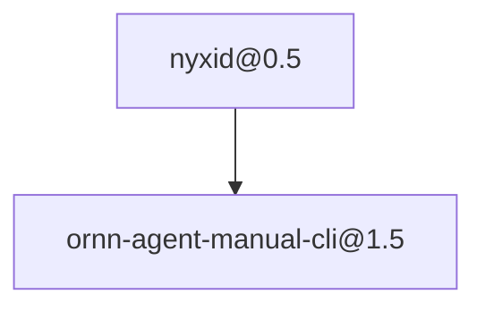

# chronoai-service-manual-bundle

> The official skillset consisting of core agent manuals to operate ChronoAI official services.

---

**Mirrored from [Ornn](https://ornn.chrono-ai.fun/skillsets/chronoai-service-manual-bundle) — read-only.**

A curated multi-skill Claude Code plugin. Edits here are NOT propagated
back; manage this skillset on Ornn.

- Latest version: `1.4`
- Skills bundled: 12

## Master prompt

How an agent should orchestrate the members of this set:

The official skillset consisting of core agent manuals to operate ChronoAI official services.

<!-- ornn:deps:start -->

```mermaid
flowchart TD
  n0["nyxid@0.5"] --> n1["ornn-agent-manual-cli@1.5"]
```
<!-- ornn:deps:end -->

## Skills in this plugin

- `aevatar-feasibility-advisor@1.0` — Decide — honestly — whether a thing the user wants to build on Aevatar is possible, what its prerequisites are, or why it cannot be done, BEFORE anyone starts building. Use this first whenever a user describes a goal rather than a concrete artifact — "can aevatar do X", "I want a bot that…", "build me something that posts to Twitter / reads my GitHub / replies on Telegram", "is it possible to…", "automate … every day", "let Lark Base trigger a workflow", "can I give my agent a fixed persona / attach skills to it / hard-limit its tools". It teaches the one hard premise (every third-party capability is brokered by NyxID), the two distinct surfaces (outbound connector vs inbound channel), external HTTP trigger options such as Lark Base automation, how to check what is actually connectable, the prerequisite for each capability class, what is host-gated (and so not self-serve), and what is genuinely impossible without new NyxID/Aevatar platform work — so you can negotiate scope and give the user a straight answer plus next steps instead of over-promising. It also separates the three different reasons a capability can be unavailable — not connected (user fixes), host-gated (host fixes), and not deployed (needs a build that exposes it) — so "agent profile" style asks get a straight answer instead of a guess. It scopes; it does not build (hand off to workflow-authoring / team-builder / service-publisher / scheduler / agent-profile-management).
- `aevatar-platform-map@1.6` — Entry point, panorama, and router for the Aevatar skill family. Use before building, running, publishing, scheduling, externally triggering, or operating Aevatar resources; configuring an Agent Profile; assessing managed/private codex_exec feasibility and setup; running the canonical Codex readiness proof; authoring a workflow with codex_exec; diagnosing a Codex failure; or deciding which companion skill owns a request. It teaches resource and identity boundaries, NyxID-brokered auth, client REST versus in-session tools, deployment gates, and exact handoffs without treating member, workflow, service, profile, schedule, or Codex capabilities as one lifecycle.
- `aevatar-scheduler@1.4` — Create and manage recurring Aevatar runs — and route to the RIGHT scheduling resource first, because there are three. Use when a user wants to "schedule", "run on a cron", "set up a recurring run", "run every day/hour/Monday", "automate this service on a timer", "schedule my team member workflow", "preview a cron", "pause/resume/disable a schedule", "run it now", "reauthorize or delete an automation" — or hits token_expired on a scheduled run's late steps. An already-bound Studio Team member workflow is canonically scheduled through aevatar_schedule_member_workflow or /api/scopes/{scopeId}/teams/{teamId}/members/{memberId}/automations and gets a dedicated, restricted Agent Key whose raw material lives only in the secret vault; generic /api/schedules is a separate platform resource for raw service invocations and envelopes, not a fallback for Team members. Covers preflight, the Agent Key lifecycle (create, pause/resume, update, reauthorize, delete with independent NyxID and Vault revocation tracks), 202-is-admission-only semantics, preview, enable/disable, run-now, and diagnosing a credential failure by credentialSourceKind rather than by assuming a 300-second broker token. Publish the service first with the service-publisher skill.
- `aevatar-service-publisher@1.3` — Publish an Aevatar member, team, or workflow as an invocable service and (host permitting) register it with NyxID, then verify, invoke, or wire external HTTP triggers such as Lark Base automation — all over the REST API. Use when a user wants to "publish/bind a service", "expose my workflow/team as a service", "register it with NyxID", "make it callable", "get the service slug/URL", "invoke my service", "let Lark Base call my workflow", "trigger this workflow from an external webhook", or "version/deploy/roll out a service". It covers the simple scope binding, reading back a member's published service, the full account-level service lifecycle (revision → publish → deploy → rollout), how to confirm the NyxID registration (slug + status), how to invoke an endpoint, and how to distinguish direct NyxID proxy triggering from host-gated externalExposure. Build the team/member first with the team-builder skill.
- `aevatar-team-builder@1.3` — Build an Aevatar agent team and its members over the REST API. Use when a user wants to "create a team", "add a member", "make a workflow member / script member / gagent member", "set the team's entry point", or "assemble agents into a team". It creates the team, creates members whose implementation is a workflow (most common), a script, or a hosted gagent, binds each member's concrete implementation (the workflow YAML is attached here), waits for the async binding to succeed, and sets the team entry member. Author the workflow YAML first with the workflow-authoring skill; publish the result as a service with the service-publisher skill.
- `aevatar-triage@1.2` — Use AFTER something goes wrong while using Aevatar — a user hits an error, failure, or confusing behavior and you must find whether it lives in Aevatar, NyxID, or Ornn, then act. Triggers - "aevatar is erroring", "why did my workflow fail", "my scheduled run did not fire", "my bot does not reply", "connector 401/403", "my scheduled run hit token_expired", "skill won't pull/upload", "this endpoint 404s but I think it exists", "is this an aevatar, nyxid, or ornn bug", "file an issue", "am I using this right". It reads credentialSourceKind before interpreting any scheduled-run credential failure (dedicated Agent Keys are not fire-time broker tokens and must not be diagnosed with the 300 s TTL), and probes the live OpenAPI surface before calling a 404 a defect, since some contracts exist in code but are not deployed. It attributes the failure by tracing the request path, pulls that layer's real public source for a code-grounded root cause citing file and line, then branches - draft and, only on explicit user confirmation, file a precise GitHub issue when behavior violates the layer's published contract, or explain the correct usage from the code when it is a usage mistake. The after-it-breaks counterpart to aevatar-feasibility-advisor; never auto-files, de-dups first, never claims a root cause without a code citation. Works locally (git + gh) and server-side (nyxid_proxy + api-github).
- `aevatar-workflow-authoring@1.5` — Author, validate, and persist an executable aevatar workflow from a natural-language request — use it when the user wants to create, build, set up, or automate a multi-step task as a runnable aevatar workflow (make a workflow that…, automate…, build a pipeline…, set up a recurring…). It generates workflow YAML, dispatch-validates it, then saves it as a reusable workflow that can be re-run and watched in the observatory. Not for running an existing workflow — search for that and start it instead.
- `fallback-to-calling-agent@1.0` — Universal try-catch fallback for the aevatar model. Use whenever, after a genuine attempt, you cannot complete the user's request with available server-side capabilities — no matching skill/workflow/connector/tool, a terminal failure, or a task that inherently needs the caller's local environment (files, shell, local context). Instead of failing opaquely or fabricating, return the original request verbatim to the calling agent so it can finish with its own local tools. Generic by design — addresses "the calling agent" with no hardcoded client or skill names.
- `firecrawl-via-nyxid@1.1` — Teach an aevatar agent to run Firecrawl web-research/agent jobs through NyxID (submit, poll, then read the result).
- `github-via-nyxid@1.0` — Operate a user's GitHub account through NyxID's credential-brokering proxy (service slug api-github) — read and write repositories, files, issues, pull requests, commits, branches, Actions, gists and anything else the GitHub REST API exposes, all on the user's behalf and without ever handling a raw token. NyxID injects the user's GitHub credential server-side. Use when an agent needs to read from or act on GitHub for a user who has connected their GitHub account in NyxID.
- `nyxid@0.5` — Brokers credentials for downstream services (OpenAI, Anthropic, GitHub, Lark, custom APIs, SSH, MCP) so the agent never sees raw API keys or OAuth tokens. Use whenever the user asks to call, proxy, or authenticate against a third-party API/service, mentions NyxID, asks to "connect", "add a service", "set up an API key", manage credentials/nodes/MCP, send messages through bot platforms, or wire up SSH access. Operate exclusively through the `nyxid` CLI.
- `ornn-agent-manual-cli@1.5` — The manual an AI agent loads to operate Ornn — the model-agnostic skill-lifecycle API (an npm-style registry + CLI for agent skills) — via the NyxID CLI (`nyxid proxy request ornn-api …`). Load and follow this skill WHENEVER the user asks to do anything with Ornn skills or skillsets. Skills: search Ornn or find a skill, pull or install a skill (or a specific version), run a skill, build and upload a skill, publish a new version, make a skill public / private / shared, run or read a security audit, deprecate or delete a version, diff two versions, check usage analytics, bind a skill to a NyxID service, link a skill to GitHub or sync from source, manage npm-style dist-tags, or transfer skill ownership. Skillsets — curated multi-skill bundles with a required master prompt: bundle skills into a set, create or publish a skillset, resolve its closure in one call, export a skillset as a Claude Code marketplace plugin, transfer skillset ownership, or diagnose why a shared skillset isn't visible (visibility derives from its member skills). Also load it to check your quota or pick an LLM model before an SSE call, and on phrases like 'share my skill', 'bundle these skills', or 'export as a Claude Code plugin'. Once loaded, the agent runs the whole search → pull → execute → build → upload → share lifecycle with no further setup — this is the authoritative Ornn↔agent contract, paired with references/api-reference.md (full per-endpoint catalogue + error legend).

Each member ships its own `SKILL.md` under `skills/<name>/`.

## Install

```bash
/plugin marketplace add ChronoAIProject/nyx-skills
/plugin install chronoai-service-manual-bundle@nyx-skills
```

> Third-party marketplaces default to auto-update OFF. Enable it in
> `/plugin` → Marketplaces if you want this skillset to update automatically.
