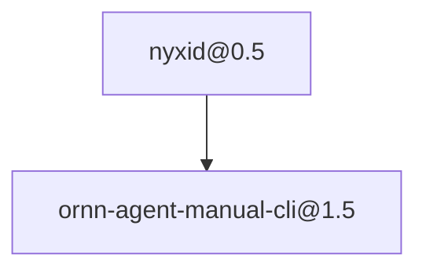

# chronoai-service-manual-bundle

> The official skillset consisting of core agent manuals to operate ChronoAI official services.

---

**Mirrored from [Ornn](https://ornn.chrono-ai.fun/skillsets/chronoai-service-manual-bundle) — read-only.**

A curated multi-skill Claude Code plugin. Edits here are NOT propagated
back; manage this skillset on Ornn.

- Latest version: `1.4`
- Skills bundled: 12

## Master prompt

How an agent should orchestrate the members of this set:

The official skillset consisting of core agent manuals to operate ChronoAI official services.

<!-- ornn:deps:start -->

```mermaid
flowchart TD
  n0["nyxid@0.5"] --> n1["ornn-agent-manual-cli@1.5"]
```
<!-- ornn:deps:end -->

## Skills in this plugin

- `aevatar-feasibility-advisor@1.0` — Use before building when a user asks whether Aevatar can achieve a goal, what prerequisites it has, or why it is unavailable. Triggers include bots and third-party APIs, inbound channels, external HTTP triggers, schedules, service exposure, Agent Profiles and tool ceilings, and bounded managed or private-host codex_exec work. It distinguishes outbound connectors from inbound channels and separates not connected, host-gated, not deployed, and genuinely unsupported outcomes. It chooses managed_sandbox versus private_ssh without promising repository, model, credential, runtime, or deployment capabilities the caller does not control, then routes feasible work to the owning Aevatar skill.
- `aevatar-platform-map@1.6` — Entry point, panorama, and router for the Aevatar skill family. Use before building, running, publishing, scheduling, externally triggering, or operating Aevatar resources; configuring an Agent Profile; assessing managed/private codex_exec feasibility and setup; running the canonical Codex readiness proof; authoring a workflow with codex_exec; diagnosing a Codex failure; or deciding which companion skill owns a request. It teaches resource and identity boundaries, NyxID-brokered auth, client REST versus in-session tools, deployment gates, and exact handoffs without treating member, workflow, service, profile, schedule, or Codex capabilities as one lifecycle.
- `aevatar-scheduler@1.4` — Create and manage recurring Aevatar runs and route to the correct scheduling resource. Use for cron, recurring Team member workflows, scheduled skill agents, typed service invocations, pause/resume, run-now, reauthorization, deletion, or credential triage. Team member automation uses its dedicated route and Agent Key; generic schedules accept typed service invocation only. External raw actor/envelope schedules are retired and must fail closed.
- `aevatar-service-publisher@1.3` — Publish an Aevatar member, team, or workflow as an invocable service and (host permitting) register it with NyxID, then verify, invoke, or wire external HTTP triggers such as Lark Base automation — all over the REST API. Use when a user wants to "publish/bind a service", "expose my workflow/team as a service", "register it with NyxID", "make it callable", "get the service slug/URL", "invoke my service", "let Lark Base call my workflow", "trigger this workflow from an external webhook", or "version/deploy/roll out a service". It covers the simple scope binding, reading back a member's published service, the full account-level service lifecycle (revision → publish → deploy → rollout), how to confirm the NyxID registration (slug + status), how to invoke an endpoint, and how to distinguish direct NyxID proxy triggering from host-gated externalExposure. Build the team/member first with the team-builder skill.
- `aevatar-team-builder@1.3` — Build an Aevatar agent team and its members over the REST API. Use when a user wants to "create a team", "add a member", "make a workflow member / script member / gagent member", "set the team's entry point", or "assemble agents into a team". It creates the team, creates members whose implementation is a workflow (most common), a script, or a hosted gagent, binds each member's concrete implementation (the workflow YAML is attached here), waits for the async binding to succeed, and sets the team entry member. Author the workflow YAML first with the workflow-authoring skill; publish the result as a service with the service-publisher skill.
- `aevatar-triage@1.2` — Use after an Aevatar workflow, codex_exec call, schedule, channel, connector, skill, Agent Profile, or control-plane request fails or behaves unexpectedly. It applies when the agent must attribute the first broken boundary across Aevatar, NyxID, Ornn, chrono-sandbox/gVisor, the managed runner, or private SSH; distinguish credential sources and deployment gaps; preserve sanitized evidence; determine defect versus usage; or draft an issue for explicit user confirmation. Never use it to guess a root cause from one error string or auto-file.
- `aevatar-workflow-authoring@1.5` — Author, preview, validate, and persist an executable aevatar workflow from a natural-language request. Use it when the user wants to create, build, set up, automate, or feature-probe a multi-step task as a runnable Aevatar workflow. It covers exact NyxID operation and authored-request admission, bounded YAML, file inputs, terminal run verification, feature-equivalent evidence boundaries, and reusable publication. Not for blindly rerunning an existing failed workflow.
- `fallback-to-calling-agent@1.0` — Universal try-catch fallback for the aevatar model. Use whenever, after a genuine attempt, you cannot complete the user's request with available server-side capabilities — no matching skill/workflow/connector/tool, a terminal failure, or a task that inherently needs the caller's local environment (files, shell, local context). Instead of failing opaquely or fabricating, return the original request verbatim to the calling agent so it can finish with its own local tools. Generic by design — addresses "the calling agent" with no hardcoded client or skill names.
- `firecrawl-via-nyxid@1.1` — Teach an aevatar agent to run Firecrawl web-research/agent jobs through NyxID (submit, poll, then read the result).
- `github-via-nyxid@1.0` — Operate a user's GitHub account through NyxID's credential-brokering proxy (service slug api-github) — read and write repositories, files, issues, pull requests, commits, branches, Actions, gists and anything else the GitHub REST API exposes, all on the user's behalf and without ever handling a raw token. NyxID injects the user's GitHub credential server-side. Use when an agent needs to read from or act on GitHub for a user who has connected their GitHub account in NyxID.
- `nyxid@0.5` — Brokers credentials for downstream services (OpenAI, Anthropic, GitHub, Lark, custom APIs, SSH, MCP) so the agent never sees raw API keys or OAuth tokens. Use whenever the user asks to call, proxy, or authenticate against a third-party API/service, mentions NyxID, asks to "connect", "add a service", "set up an API key", manage credentials/nodes/MCP, send messages through bot platforms, or wire up SSH access. Operate exclusively through the `nyxid` CLI.
- `ornn-agent-manual-cli@1.5` — The manual an AI agent loads to operate Ornn — the model-agnostic skill-lifecycle API (an npm-style registry + CLI for agent skills) — via the NyxID CLI (`nyxid proxy request ornn-api …`). Load and follow this skill WHENEVER the user asks to do anything with Ornn skills or skillsets. Skills: search Ornn or find a skill, pull or install a skill (or a specific version), run a skill, build and upload a skill, publish a new version, make a skill public / private / shared, run or read a security audit, deprecate or delete a version, diff two versions, check usage analytics, bind a skill to a NyxID service, link a skill to GitHub or sync from source, manage npm-style dist-tags, or transfer skill ownership. Skillsets — curated multi-skill bundles with a required master prompt: bundle skills into a set, create or publish a skillset, resolve its closure in one call, export a skillset as a Claude Code marketplace plugin, transfer skillset ownership, or diagnose why a shared skillset isn't visible (visibility derives from its member skills). Also load it to check your quota or pick an LLM model before an SSE call, and on phrases like 'share my skill', 'bundle these skills', or 'export as a Claude Code plugin'. Once loaded, the agent runs the whole search → pull → execute → build → upload → share lifecycle with no further setup — this is the authoritative Ornn↔agent contract, paired with references/api-reference.md (full per-endpoint catalogue + error legend).

Each member ships its own `SKILL.md` under `skills/<name>/`.

## Install

```bash
/plugin marketplace add ChronoAIProject/nyx-skills
/plugin install chronoai-service-manual-bundle@nyx-skills
```

> Third-party marketplaces default to auto-update OFF. Enable it in
> `/plugin` → Marketplaces if you want this skillset to update automatically.
